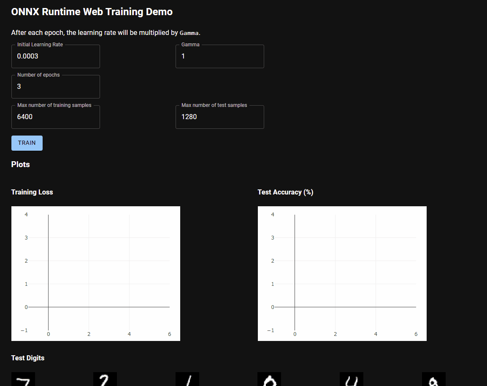

# Train PyTorch Models in JavaScript
Convert a [PyTorch](https://https://pytorch.org) model and train it in JavaScript using [ONNX Runtime Web](https://github.com/microsoft/onnxruntime/tree/master/js/web).

# Overview
Steps:

0. Define your PyTorch model. You probably already did this.
1. Use the new utility method to export an ONNX gradient graph for the model.
2. Set up an optimizer graph.
3. Load the graphs in JavaScript.
4. Use the graphs to train the model.

Here's how it looks in the browser:



Details:

## 0. Define your PyTorch model
You probably already did this.
Here's our simple example:
```python
import torch

class MyModel(torch.nn.Module):
	def __init__(self,
				 input_size: int,
				 hidden_size: int,
				 num_classes: int):
		super(MyModel, self).__init__()

		self.fc1 = torch.nn.Linear(input_size, hidden_size)
		self.relu = torch.nn.ReLU()
		self.fc2 = torch.nn.Linear(hidden_size, num_classes)

	def forward(self, x):
		out = self.fc1(x)
		out = self.relu(out)
		out = self.fc2(out)
		return out
```

You can train it in Python to get some good initial weights but that's not required to export it and then train it in JavaScript.

## 1. Export the model's gradient and optimizer graphs
We're going to create an ONNX graph that can compute gradients when given training data.

You can follow along here or see the full example in [example.py](./export/example.py) or [mnist/example.py](./export/mnist/example.py).

# MNIST Examples
To export the MNIST example:
```bash
python -m mnist.example
```

To train the MNIST example to help verify the model:
```bash
python -m mnist.train
```

### 1. Install some dependencies
*I did this in Windows Subsystem for Linux (WSL).*

* PyTorch

If you don't already have PyTorch installed, see [pytorch.org](https://pytorch.org/get-started/locally/) for how to install it on your system.
For example:
```bash
conda install pytorch torchvision torchaudio cpuonly -c pytorch
```

* ONNX Runtime

See [onnxruntime.ai](https://onnxruntime.ai) for all installation options.
The utility method we'll use is new in version 1.11 so you'll need at least that version.
Make sure that the version you use it the same as the version of ONNX Runtime Web that you'll use later.
This repository includes a pre-built ONNX Runtime Web version for version 1.11 so we'll use that version for our Python onnxruntime dependencies.

Example:
```bash
pip install onnx 'onnxruntime==1.11.*' 'onnxruntime-training==1.11.*'
```

### 2. Export the model's gradient graph

```python
import torch
from onnxruntime.training.experimental import export_gradient_graph

# We need a custom loss function to load the graph in an InferenceSession in ONNX Runtime Web.
# You can still make the gradient graph with torch.nn.CrossEntropyLoss() and this part will work but you'll get problem later when trying to use the graph in JavaScript.
def binary_cross_entropy_loss(inp, target):
	return -torch.sum(target * torch.log2(inp[:, 0]) +
		(1-target) * torch.log2(inp[:, 1]))


loss_fn = binary_cross_entropy_loss

input_size = 10
num_classes = 2
model = MyModel(input_size=input_size, hidden_size=5, num_classes=num_classes)

# File path for where to save the ONNX graph.
gradient_graph_path = 'gradient_graph.onnx'

# We need example input for the ONNX model.
# It doesn't matter what values are filled in the but the dimensions need to be correct.
batch_size = 32
example_input = torch.randn(
	batch_size, input_size, requires_grad=True)
example_labels = torch.randint(0, num_classes, (batch_size,))

export_gradient_graph(
	model, loss_fn, example_input, example_labels, gradient_graph_path)
```

You now have an ONNX graph at `gradient_graph.onnx`.
If you want to validate it, see [orttraining_test_experimental_gradient_graph.py](https://github.com/microsoft/onnxruntime/blob/master/orttraining/orttraining/test/python/orttraining_test_experimental_gradient_graph.py) for examples.

### 3. Set up an optimizer and export it
We'll run another ONNX graph to compute the weight updates.
This repo has an example for an [Adam](https://arxiv.org/abs/1412.6980) optimizer [here](./export/optim/adam.py).

The optimizer is kept separate for a few reasons:
* You can easily swap it for a different optimizer.
* Historically, putting the model's gradient graph and the optimizer graph together was too complex to support many different types of optimizers.

```python
from optim.adam import AdamOnnxGraphBuilder

optimizer = AdamOnnxGraphBuilder(model.named_parameters())
onnx_optimizer = optimizer.export()
onnx.save(onnx_optimizer, 'optimizer_graph.onnx')
```

## 2. Load the model in JavaScript
We'll use [ONNX Runtime Web](https://github.com/microsoft/onnxruntime/tree/master/js/web) to load the gradient graph.

At this time (May 2022), this only works with custom ONNX Runtine Web builds which have training operators enabled but the required files are included in this repository.
The officially published ONNX Runtime Web doesn't support the certain operators in our exported gradient graph with gradient calculations such as `GatherGrad` when using an InferenceSession.

### 0. (Optional) Build ONNX Runtime Web with training operators enabled.

For your convenience, we included a build of ONNX Runtime Web with training operators enabled for ONNX Runtime version 1.11.
You can see other versions [here](https://github.com/microsoft/onnxruntime/releases).

If you would like to build it yourself, here's some commands that should help assuming you're using Linux and have CMake and `conda` setup:
```bash
conda create --name ort-dev python=3.8 numpy h5py
conda activate ort-dev
conda install -c anaconda libstdcxx-ng
conda install pytorch torchvision torchaudio cpuonly -c pytorch
pip install flake8 pytest
# This is a specific tag that should work, you can try with other versions but this tutorial will work best if the version matches the onnxruntime and onnxruntime-training versions you installed for Python earlier.
commit="2dfd81b9bb097c90388010e5b7d298498274f8d9"
git clone --recursive git@github.com:microsoft/onnxruntime.git
cd onnxruntime
git checkout ${commit}
git submodule update --init --recursive
pip install -r requirements-dev.txt
```

For the build command, there are instructions at [ONNX Runtime Web](https://github.com/microsoft/onnxruntime/tree/master/js/web) which currently links to specific instructions [here](https://github.com/microsoft/onnxruntime/blob/master/js/README.md#Build-2).
When you get to the "Build ONNX Runtime WebAssembly" step, you'll need to add `--enable_training --enable_training_ops` to the build command.
For example:
```bash
./build.sh --build_wasm --parallel $(expr `nproc` - 1) --enable_training --enable_training_ops --skip_submodule_sync --skip_tests
./build.sh --build_wasm --enable_wasm_simd --parallel $(expr `nproc` - 1) --enable_training --enable_training_ops --skip_submodule_sync --skip_tests
./build.sh --build_wasm --enable_wasm_threads --parallel $(expr `nproc` - 1) --enable_training --enable_training_ops --skip_submodule_sync --skip_tests
./build.sh --build_wasm --enable_wasm_simd --enable_wasm_threads --parallel $(expr `nproc` - 1) --enable_training --enable_training_ops --skip_submodule_sync --skip_tests
cp build/Linux/Debug/ort-wasm*.wasm js/web/dist/
cp build/Linux/Debug/ort-wasm*.js js/web/lib/wasm/binding/
cd js/web
NODE_OPTIONS=--max-old-space-size=4096 npm run build
```

You might get some errors but if you see ort.js and ort-web.js in the dist/ folder, then it should work.

### 1. Setup the example project.

   0. (If you built ONNX Runtime Web yourself)
   Put the files from the ONNX Runtime Web build (ort.js and others such as the wasm files, if needed) in `training/public/onnxruntime_web_build_inference_with_training_ops/`:
   ```bash
   # In the onnxruntime root directory, do:
   rm <your workspace>/train-pytorch-in-js/training/public/onnxruntime_web_build_inference_with_training_ops/*.{js,wasm}
   cp js/web/dist/* js/web/lib/wasm/binding/* <your workspace>/train-pytorch-in-js/training/public/onnxruntime_web_build_inference_with_training_ops
   # Get the declaration files.
   cp js/common/dist/lib/*.d.ts <your workspace>/FL/train-pytorch-in-js/training/src/ort
   ```
   1. Copy your gradient graph to `training/public/gradient_graph.onnx`:
   ```bash
   cp *_graph.onnx training/public
   ```
   2. Go to the `training` folder:\
   `cd training`
   3. Run `yarn install`
   4. Run `yarn start`\
   Your browser should open and you should see that the gradient graph gets loaded and training starts.
